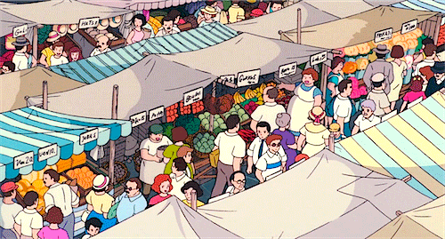
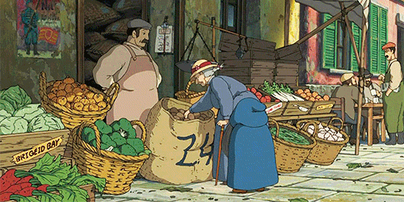

  

<h1 align="center">🎉 Market Maven 🎉</h1>

 Your virtual farmers market! Discover local farmers, artisans, and artists within your local community. Connect with sellers to purchase fresh foods, personalized gifts, and support a local small market. Or, easily create your own market and begin selling your own goods! Rediscover the joy of locally sourced and crafted goods with Market Maven! 

<h2>MVP 🎊</h2>
<ul>
  <li>User Account with Google Login Authentication</li>
  <ul>
  <li>store user location so we can find local markets</li>
 </ul>
  <li>Search Page for viewing local markets</li>
 <ul>
  <li>such as market goods type, distance from user, market name, etc</li>
 </ul>
  <li>Ability to select market and view its general information and view their products</li>
  <ul>
  <li>"Linh's Furry Art" <---- MUST HAVE</li>
 </ul>
  <li>Ability to select a market and open a chat room with them </li>
  <li>Ability to 'like' markets and products</li>
  <li>Ability to create your own market</li>
</ul>

<h2>Stretch Goals 🎊</h2>
<ul>
  <li>Bank Account/PayPal/Venmo integration</li>
  <li>Include Google Maps Integration</li>
  <li>QR Code to share products/shops</li>
  <li>Shop notepad to keep track of sales and commissions</li>
  <li>Purchase/Sale Tracker</li>
</ul>

<h2>Tech Stack 🎊</h2>
<ul>
  <li>Frontend: ReactJS </li>
  <li>Backend: NodeJS/Express  </li>
  <li>Database: MongoDB</li>
</ul>

<h2>Milestones 🎊</h2>

<table>
  <tr>
    <th>Week</th>
    <th>Frontend Tasks</th>
    <th>Backend Tasks</th>
    <th>Links</th>
  </tr>
  <tr>
    <td>Week 1</td>
    <td>
       <ul>
        <li>Meet the team! Set up environment.</li>
        <li>Git and IDEs should be set up, teach basic git commands</li>
        <li>Split team into Frontend/Backend</li>
        <li>Frontend: Start working on Figma and have draft done by next meeting</li>
        <li>Homework: Tech Stack tutorials</li>
      </ul>
    </td>
     <td>
       <ul>
        <li>Meet the team! Set up environment.</li>
        <li>Git and IDEs should be set up, teach basic git commands</li>
        <li>Split team into Frontend/Backend</li>
        <li>Backend: Have database and Express set up by next meeting. Show progress with User Authentication by next meeting.</li>
      </ul>
    </td>
    <td>
       <ul>
        <li>Figma Link: </li>
        <li>MERN Stack Intro: </li>
        <li>Express and NodeJS: </li>
        <li>React: </li>
        <li>MongoDB:</li>
        <li>MongoDB Set Up:</li>
      </ul>
    </td>
  </tr>
  <tr>
    <td>Week 2/3</td>
    <td>
      <ul>
        <li><i>Deliverable: Figma draft should be completed</i></li>
        <li><i>Deliverable: Tutorial should be completed</i></li>
        <li>Frontend: Recieve Feedback on Figma</li>
        <li>Frontend: Begin coding pages, starting with login/registration. Include Logging in with Google</li>
        <li>Frontend: Work on the navigation bar for the app</li>
        <li>Homework: Finish coding Login/Registration Pages, Navigation bar, and begin other pages</li>
      </ul>  
    </td>
    <td>
      <ul>
        <li><i>Deliverable: NodeJS/Express should be set up</i></li>
        <li><i>Deliverable: MongoDB should be set up</i></li>
        <li><i>Deliverable: Tutorials should be completed</i></li>
        <li>Backend: Implement login functionality, including with Google Auth</li>
        <li>Backend: Continue setting up the database for future</li>
        <li>Homework: Finish login functionality</li>
      </ul>  
    </td>
    <td>
      <ul>
        <li>React Login Page Tutorial</li>
        <li>React Routing</li>
        <li>Google Auth in MERN</li>
      </ul>  
    </td>
  </tr>
  <tr>
    <td>Week 4/5</td>
    <td>
      <ul>
        <li><i> Deliverable: Login and Registration Pages done </i></li>
        <li>Frontend: Finishing 75% of Frontend</li>
        <li>Frontend: Profile Page, Search Page, Market Page, Product Page, etc</li>
        <li>Homework: Have 75% of the Frontend finished (Can be rough, we can make perfect later)</li>
      </ul> 
    </td>
    <td>
      <ul>
        <li><i>Deliverable: Login functionality should be complete</i></li>
        <li><i>Deliverable: MongoDB should be set up</i></li>
        <li>Backend: Integrate Login functionality with Frontend pages</li>
        <li>Backend: Integrate Google Maps Matrix API for finding distance to shops</li>
        <li>Backend: Learn how to filter data from the database for use on the Search Page</li>
        <li>Homework: Integrate Login functionality, Integrate Google Maps Matrix API, Learn to filter data from database</li>
      </ul>   
    </td>
    <td>
      <ul>
        <li>Google Maps Matrix API Tutorial</li>
        <li>Filter DB Information</li>
      </ul>   
    </td>
  </tr>
   <tr>
    <td>Week 6/7</td>
    <td>
      <ul>
        <li><i>Deliverable: Almost all of Frontend should be done</i></li>
        <li>Frontend: Finish Frontend fully and clean up all pages</li>
        <li>Frontend: Help Backend with integration</li>
        <li>Frontend: Begin Stretch Goal implementation</li>
        <li>Homework: Frontend will be 100% complete</li>
      </ul> 
    </td>
     <td>
      <ul>
        <li><i>Deliverable: Login functionality fully integrated</i></li>
        <li><i>Deliverable: Google Maps Matrix API Learned</i></li>
        <li>Backend: Fully integrate Google Maps Matrix API and Search functionality with Frontend</li>
        <li>Backend: Begin implementing chosen Stretch Goal</li>
        <li>Homework: MVP will be 100% complete</li>
      </ul> 
    </td>
     <td>
      <ul>
        <li>Links TBD</li>
      </ul> 
    </td>
  </tr>
  <tr>
    <td>Week 8/9</td>
    <td>
      <ul>
        <li>Frontend: Clean up Frontend and finish implementing stretch Goal</li>
        <li>Frontend: Begin working on Presentation Slides</li>
        <li>Homework: Finish a demo video</li>
      </ul> 
    </td>
    <td>
      <ul>
        <li>Backend: Complete integration of backend and frontend and Stretch Goal</li>
        <li>Backend: Begin working on Presentation Script</li>
        <li>Homework: Finish presentation script</li>
      </ul> 
    </td>
    <td>
      <ul>
        <li>Past Presentation Night</li>
        <li>Past Presentation Slides</li>
        <li>Presentation Drive</li>
      </ul> 
    </td>
  </tr>
  <tr>
    <td>Week 10</td>
    <td>Presentation Practice!</td>
    <td>Presentation Practice!</td>
    <td>Slay</td>
  </tr>
   <tr>
    <td>Week 11</td>
    <td>Presentation Night!!</td>
    <td>Y'all got this!!</td>
    <td>Wooo lets gooo!!</td>
  </tr>
</table>

<h1>Resources🎊</h1>
<ul>
</ul> 

<h1>Git Cheat Sheet🎊</h1>

<table>
  <tr>
    <th></th>
    <th>Pulling from repo</th>
  </tr>
  <tr>
    <td>Step 1</td>
    <td>I usually will do 'git status' just to make sure I am on the right branch and everything is okay</td>
  </tr>
  <tr>
    <td>Step 2</td>
    <td>'git add .'</td>
  </tr>
  <tr>
    <td>Step 3</td>
    <td>'git commit -m "pulling"'</td>
  </tr>
  <tr>
    <td>Step 4</td>
    <td>"git pull origin main" -> or replace main with another branch if needed</td>
  </tr>
</table>

<table>
  <tr>
    <th></th>
    <th>Pushing to repo</th>
  </tr>
  <tr>
    <td>Step 1</td>
    <td>I usually will do 'git status' just to make sure I am on the right branch and everything is okay</td>
  </tr>
  <tr>
    <td>Step 2</td>
    <td>'git add .'</td>
  </tr>
  <tr>
    <td>Step 3</td>
    <td>'git commit -m "-insert features you have added-"'</td>
  </tr>
  <tr>
    <td>Step 4</td>
    <td>"git push origin -your-branch-"</td>
  </tr>
  <tr>
    <td>Step 5</td>
    <td>Navigate to Github and create a pull request</td>
  </tr>
</table>

<table>
  <tr>
    <th></th>
    <th>Creating a Branch</th>
  </tr>
  <tr>
    <td>Step 1</td>
    <td>I usually will do 'git status' just to make sure I am on the right repo and everything is okay</td>
  </tr>
  <tr>
    <td>Step 2</td>
    <td>'git branch -b -insert your name here-'</td>
  </tr>
  <tr>
    <td>Step 3</td>
    <td>'git checkout -your branch name-'</td>
  </tr>
  <tr>
    <td>Step 4</td>
    <td>commit and push to see your branch appear on Github</td>
  </tr>
</table>

<h1>Team Market Maven 🎉</h1>

<h2>🎊Developers🎊</h2>
<h3>Name</h3> 
<h3>Name</h3> 
<h3>Name</h3> 
<h3>Name</h3> 

<h2>🎊Project Manager🎊</h2>
<h3>Clara Conner</h3> 

<h2>🎊Industry Mentor🎊</h2>
<h3>Linh Ly</h3>  

  

<h1>❤️🎊🎉Thanks for checking out Market Maven! 🎉🎊❤️</h1>

  

